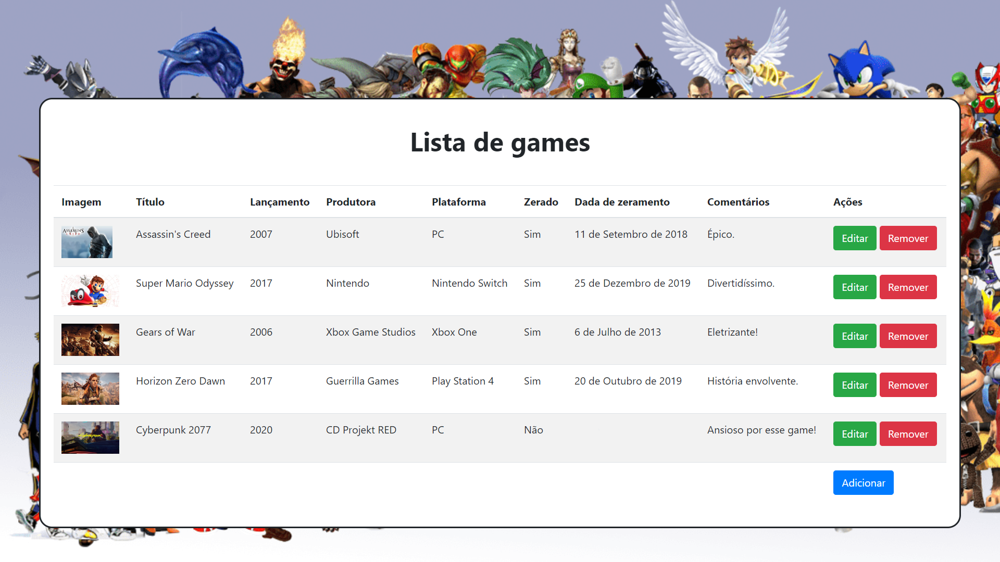

# Desafio - Fábrica de Software - Backend
Versão preview: ainda pode sofrer alerações até o final do prazo do desafio.

## Gedgame - Gerenciador de games

O Gedgame é um sistema de gerenciamento para aqueles que adoram jogos e querem manter os registros dos jogos que possui, quando zerou, comentários sobre eles, dentre outras funcionalidades.

### Prévia

### Instruções para testar a aplicação

Clone o projeto em sua máquina local:

`git clone --branch emerson-bezerra https://gitlab.com/matheusk181/desafio-fabrica-de-software.git`

Acesse a pasta do projeto:

`cd desafio-fabrica-de-software`

Instale as dependências necessárias:

`pip install -r requirements.txt`

Acesse a pasta da aplicação:

`cd gedgam`

Inicie o servidor local para a aplicação e acesse o link que aparecerá no terminal:

`python manage.py runserver`
